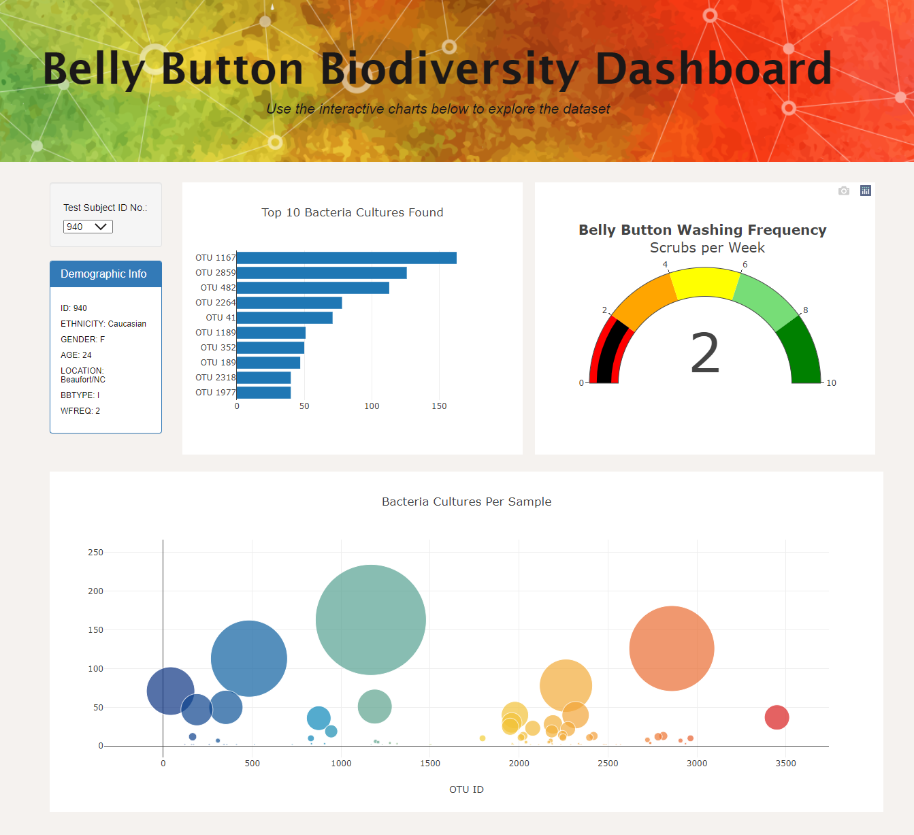

# Biodiversity Analysis (Using Plotly)

Using your knowledge of JavaScript, Plotly, and D3.js, we're creating a webpage that displays demographic information and charts related to bacterial data of each volunteer.
By selecting a volunteer ID in the dropdown, the charts indicate different metrics related to that volunteer.

The website can be accessed at the following: https://yorojanine.github.io/Plotly/

There you will see the three different types of charts created: (1) Horizontal Bar Chart (2) Gauge Chart (3) Bubble Chart

Customizations have been added to the page (differing from the original module image):
1) Added image to the jumbotron
2) Expanded the jumbotron across the page using `container-fluid` and adding an additional `div`
3) Updated the font of the title using `font-family`
4) Changed the background color of the webpage
5) Changed the colorscale of the bubble chart to "Portland"

<b>Orignal for reference:</b> 

